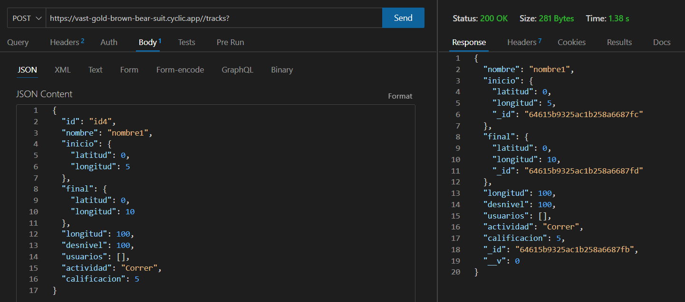
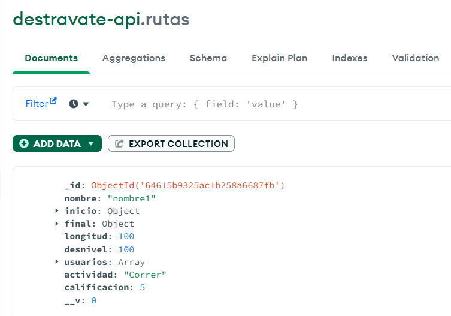
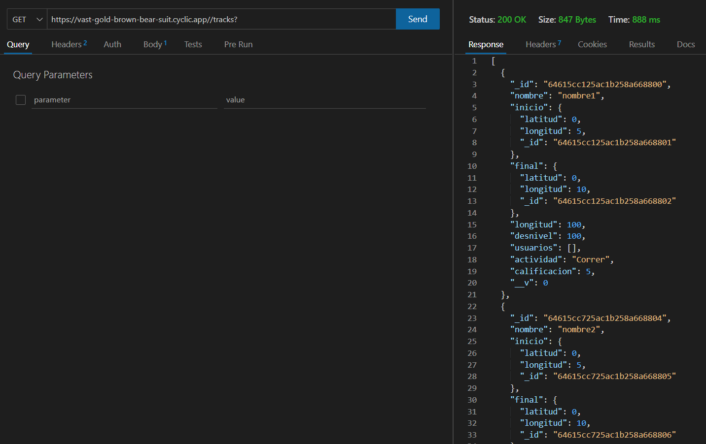
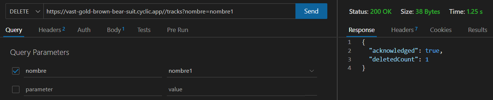
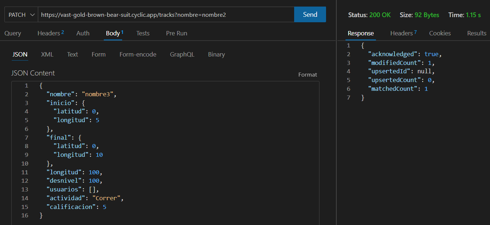
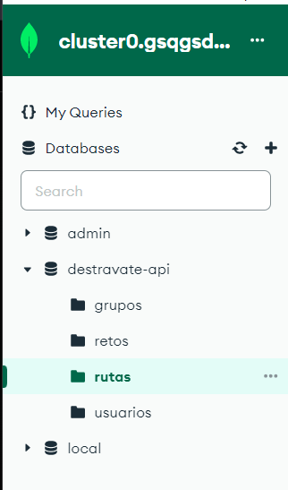
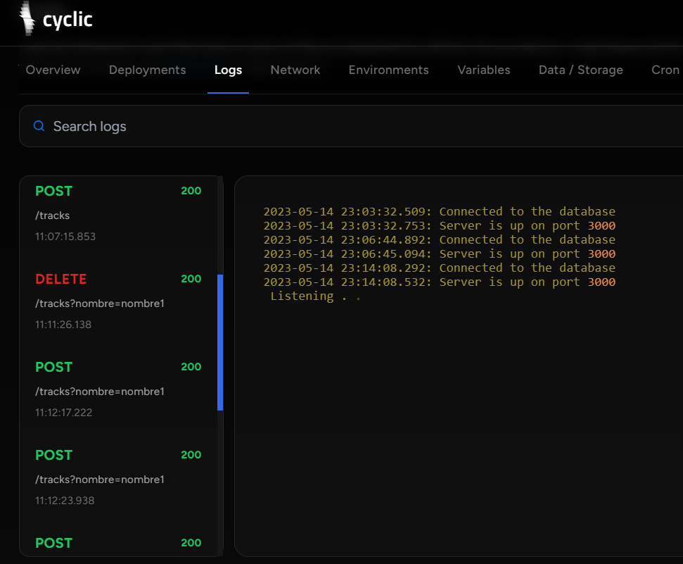

# Desarrollo de Sistemas Informáticos 

## Práctica 12. Destravate: API Node/Express
## Date: 15/05/2023
## El GitHub Pages se encuentra en el siguiente [link](https://ull-esit-inf-dsi-2223.github.io/ull-esit-inf-dsi-22-23-prct12-destravate-api-grupoi/).
## El link del vídeo explicativo es el siguiente: [link]()

## Ejemplos de ejecución

### Operación POST

### Operación GET

### Operación DELETE

### Operación PATCH

## Pruebas de desarrollo

### Ejecución pruebas

## Despliegue

Para el proceso de despliegue del API REST se requería crear un clúster en MongoDB Atlas.

El primer paso fue registrarse en MongoDB Atlas y crear una organización y un proyecto. Luego, se creó un clúster compartido con el proveedor de servicios en la nube de AWS . 

Una vez creado el clúster se generó una URL de conexión con el nombre de usuario y contraseña de un usuario con permisos de lectura y modificación sobre la base de datos.

Esta URL se almacenó en una variable de entorno dentro de la plataforma Cyclic para el despliegue de API’s. 

Para el despliegue sobre esta plataforma fue necesario añadir dos script: build y start al package.json del proyecto, crear una cuenta en la plataforma y por último enlazar el repositorio público de la API.

Como resultado obtuvimos una URL (https://vast-gold-brown-bear-suit.cyclic.app/) correspondiente a un servidor siempre operativo a través del cuál podremos hacer peticiones HTTP, por ejemplo, mediante el uso de ThunderClient.

## Referencias

* [Enunciado Práctica](https://ull-esit-inf-dsi-2223.github.io/prct12-destravate-api/)
* [Cyclic](https://www.cyclic.sh/)
* [MongoDB](https://www.mongodb.com/cloud/atlas/)
* [Mongoose](https://mongoosejs.com/)
* [Ajv Scheme Validator](https://ajv.js.org/guide/typescript.html/)
* [Despliegue API](https://ull-esit-inf-dsi-2223.github.io/nodejs-theory/nodejs-deployment.html/)
